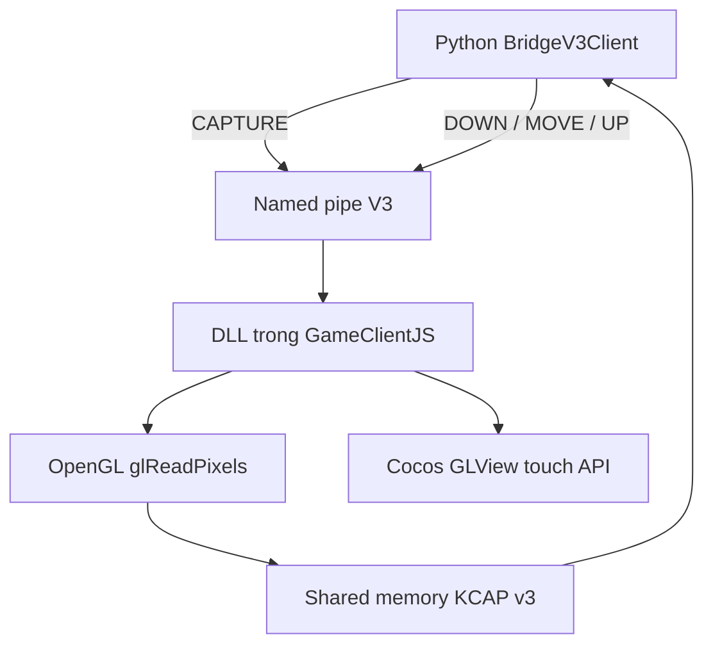

# KVTM Bridge V3 — mã nguồn, kiến trúc và biên dịch

> Tài liệu chính thức cho Bridge V3. DLL là tệp nhị phân nên không thể đọc như mã nguồn; nội dung có thể đọc, sửa và biên dịch lại nằm trong các tệp C++/Python được chép đầy đủ ở cuối tài liệu này.

## 1. Mục tiêu V3

V3 thay phần bridge chắp vá bằng một hợp đồng nhỏ, có phiên bản và kiểm tra được:

- DLL chỉ làm **capture OpenGL** và **input cảm ứng**.
- Python là chủ duy nhất của đường swipe và thời gian gesture.
- Không có resize, ép cửa sổ vuông, DPI, layout, di chuyển/ẩn cửa sổ, profile, settings hoặc nghiệp vụ AUTO trong DLL.
- V3 có tên pipe/shared-memory riêng, vì vậy có thể probe mà chưa ghi đè bridge runtime.
- Cài vào runtime bị khóa cho đến khi build, static verify, live capture và swipe timing đều có bằng chứng PASS.

V3 không sửa `components/workspace/**`, `KVTM_WORKSPACE_CONTROL.bat`, profile hoặc session.

## 2. Sơ đồ cơ chế



Capture và input dùng chung DLL nhưng không dùng chung logic thời gian:

1. Python gửi `CAPTURE`.
2. Pipe thread chuyển yêu cầu sang thread cửa sổ bằng `WM_KVTM_CAPTURE`.
3. DLL đọc BGRA từ OpenGL, đảo thứ tự hàng một lần để xuất ảnh top-down.
4. DLL ghi header KCAP v3 và pixels vào `Local\KVTM-CaptureV3-<PID>`.
5. Python kiểm tra magic/version/format/frame id trước khi nhận ảnh.
6. Với swipe, Python nội suy đường đi một lần và phát DOWN/MOVE/UP theo deadline tuyệt đối từ `time.perf_counter()`.
7. DLL chỉ chuyển từng điểm vào Cocos; DLL không sleep và không nhân duration.

## 3. Hợp đồng V3

| Thành phần | Giá trị |
|---|---|
| Kiến trúc binary | PE32 x86 |
| Export | `KvtmBridgeProtocol`, `KvtmBridgeInstall` |
| Protocol | 3 |
| Pipe | `\\.\pipe\KVTM-CocosV3-<PID>` |
| Shared memory | `Local\KVTM-CaptureV3-<PID>` |
| Magic | `KCAP` |
| Pixel format | 2 = BGRA8 top-down |
| Input | `DOWN x y`, `MOVE x y`, `UP x y` |
| Capture | on-demand `glReadPixels` |
| Timing owner | Python, monotonic absolute deadlines |
| HWND fallback | Không có trong client V3 nghiêm ngặt |

Header KCAP gồm: magic, version, header_size, width, height, stride, pixel_format, buffer_size, frame_id, status và timestamp_ms. Reader chỉ đọc pixels sau khi mọi trường hợp lệ.

## 4. Những phần cố ý loại bỏ

Static verifier chặn các token `WM_SIZING`, `WM_EXITSIZEMOVE`, `SC_MAXIMIZE`, `SetWindowPos`, `ShowWindow`, `GetDpiForWindow`, `AdjustWindowRect`, `profiles` và `settings`.

Điều này loại bỏ ba nguồn xung đột chính:

- DLL tự đổi bố cục trong khi Multi/Workspace cũng quản lý cửa sổ.
- Nhiều tầng cùng nội suy và sleep làm swipe sai tốc độ.
- Capture âm thầm rơi về một nguồn ảnh khác, gây sai orientation hoặc nhận diện không ổn định.

## 5. Một BAT Control duy nhất

Chạy:

```bat
bridge-v3\KVTM_BRIDGE_V3_CONTROL.bat
```

| Mục | Tác dụng | Có sửa runtime? |
|---|---|---|
| [1] | Biên dịch DLL + loader x86 | Không |
| [2] | Kiểm tra source/binary/phạm vi | Không |
| [3] | Inject V3 riêng và live probe theo PID | Không |
| [4] | Backup rồi cài V3 | Có, nhưng đang khóa |
| [5] | Khôi phục backup mới nhất | Có |
| [6] | Mở tài liệu này | Không |

Không chạy lệnh CMD thủ công. Các binary sinh ra nằm trong `bridge-v3/bin/`; log probe nằm trong `bridge-v3/probe-output/LATEST.txt`.

## 6. Các bước xây V3 và cổng chất lượng

| Giai đoạn | Nội dung | Trạng thái hiện tại |
|---|---|---|
| 1 | Tách source, protocol v3, bỏ layout | SOURCE_READY |
| 2 | Build MSVC x86 + static verify | LOCAL PASS, DLL SHA256 `74df4645...f893` |
| 3 | Live capture, frame id tăng, ảnh đúng chiều | LOCAL PASS: PID 1940, 1000x1000, frame 1→2, protocol V3 đúng |
| 4 | Swipe 0.50 giây, sai số trong ngưỡng | Chưa test V3 |
| 5 | Tối ưu SwapBuffers/PBO nếu profiler chứng minh cần | Chưa triển khai |
| 6 | Cài runtime và test AUTO nhận diện | LOCKED |

Không gọi FULL PASS chỉ vì source đã có. Chỉ mở khóa [4] sau bằng chứng thật của giai đoạn 2–4. PBO/SwapBuffers không được thêm trước khi đo vì đó là độ phức tạp dư thừa có thể tạo race/stale frame.

## 7. Biên dịch và kiểm tra

Yêu cầu trên Windows:

- Visual Studio Build Tools có workload Desktop development with C++ và toolchain x86.
- Python 3.11.
- GameClientJS DEV chỉ cần cho live probe.

Quy trình trong BAT:

1. [1] tìm Visual Studio bằng `vswhere.exe`.
2. Nạp `vcvarsall.bat x86`.
3. Biên dịch `kvtm_bridge_v3.cpp` với `/std:c++17 /O2 /EHsc /MT /LD`.
4. Biên dịch loader x86 với `/std:c++17 /O2 /EHsc /MT`.
5. [2] xác minh PE x86, source không chứa layout và timing chỉ có một owner.
6. [3] nhập PID đúng GameClientJS DEV; capture test luôn chạy.
7. Chỉ gõ `SWIPE` nếu đồng ý chạy gesture nhỏ 0.50 giây ở giữa game.
8. [4] vẫn bị khóa; không tự tạo `ALLOW_RUNTIME_INSTALL.txt` trước khi các gate PASS.

Rollback luôn dùng bản backup timestamp mới nhất. Phải đóng Multi và mọi ClientJS trước install/rollback để DLL không còn được load.

## 8. Giới hạn hiện tại và hướng tiếp theo

Capture V3 hiện là on-demand `glReadPixels`. Thiết kế này nhỏ và dễ xác minh nhưng có thể stall render nếu gọi quá dày. Chỉ khi log/profiler chứng minh bottleneck mới triển khai double-buffer PBO tại SwapBuffers. Khi đó vẫn giữ nguyên KCAP v3 hoặc tăng protocol nếu layout header thay đổi.

V3 chưa được nối vào AUTO production và không có HWND fallback. Đây là chủ ý để lỗi bridge hiện rõ thay vì âm thầm dùng ảnh khác khiến nhận diện sai.

---

# PHỤ LỤC A — Toàn bộ source DLL V3

Tệp chính thức: `bridge-v3/native/kvtm_bridge_v3.cpp`

```cpp
// KVTM Bridge V3 - capture + input only.
// Intentionally excluded: resize, DPI, window placement, layout and AUTO logic.
// This file is isolated from the production bridge until V3 live gates pass.
#define WIN32_LEAN_AND_MEAN
#include <windows.h>
#include <cstdio>
#include <cstring>
#include <cstdint>

namespace {
constexpr UINT WM_KVTM_TOUCH = WM_APP + 0x417;
constexpr UINT WM_KVTM_CAPTURE = WM_APP + 0x418;
constexpr wchar_t kWindowProperty[] = L"KVTM_BRIDGE_V3_CAPTURE_INPUT_ONLY";
constexpr DWORD kCaptureVersion = 3;
constexpr DWORD kPixelFormatBgra8TopDown = 2;
constexpr DWORD kMaxCaptureBytes = 64u * 1024u * 1024u;
constexpr unsigned int GL_FRONT_VALUE = 0x0404;
constexpr unsigned int GL_BACK_VALUE = 0x0405;
constexpr unsigned int GL_PACK_ALIGNMENT_VALUE = 0x0D05;
constexpr unsigned int GL_BGRA_VALUE = 0x80E1;
constexpr unsigned int GL_UNSIGNED_BYTE_VALUE = 0x1401;

enum class Phase : int { Down = 1, Move = 2, Up = 3 };
struct TouchCommand { Phase phase; float x; float y; LONG result; };
struct CaptureCommand {
    LONG result;
    DWORD frame_id;
    DWORD width;
    DWORD height;
    DWORD stride;
};
struct CaptureHeader {
    char magic[4];
    DWORD version;
    DWORD header_size;
    DWORD width;
    DWORD height;
    DWORD stride;
    DWORD pixel_format;
    DWORD buffer_size;
    DWORD frame_id;
    DWORD status;
    ULONGLONG timestamp_ms;
};

using DirectorGetInstance = void* (__cdecl*)();
using DirectorGetOpenGLView = void* (__thiscall*)(void*);
using HandleTouches = void (__thiscall*)(void*, int, int*, float*, float*);
using GlReadPixels = void (WINAPI*)(int, int, int, int, unsigned int, unsigned int, void*);
using GlGetError = unsigned int (WINAPI*)();
using GlReadBuffer = void (WINAPI*)(unsigned int);
using GlPixelStorei = void (WINAPI*)(unsigned int, int);

WNDPROC g_previous_proc = nullptr;
HWND g_window = nullptr;
HMODULE g_self = nullptr;
DirectorGetInstance g_get_director = nullptr;
DirectorGetOpenGLView g_get_view = nullptr;
HandleTouches g_touch_begin = nullptr;
HandleTouches g_touch_move = nullptr;
HandleTouches g_touch_end = nullptr;
GlReadPixels g_gl_read_pixels = nullptr;
GlGetError g_gl_get_error = nullptr;
GlReadBuffer g_gl_read_buffer = nullptr;
GlPixelStorei g_gl_pixel_store_i = nullptr;
HANDLE g_capture_mapping = nullptr;
CaptureHeader* g_capture_header = nullptr;
DWORD g_capture_capacity = 0;
volatile LONG g_capture_frame = 0;

bool same_process_window(HWND hwnd) {
    DWORD pid = 0;
    GetWindowThreadProcessId(hwnd, &pid);
    if (pid != GetCurrentProcessId() || !IsWindowVisible(hwnd)) return false;
    RECT rc{};
    return GetClientRect(hwnd, &rc) && rc.right > 100 && rc.bottom > 100;
}

BOOL CALLBACK find_window_callback(HWND hwnd, LPARAM) {
    if (same_process_window(hwnd)) {
        g_window = hwnd;
        return FALSE;
    }
    return TRUE;
}

bool resolve_cocos() {
    HMODULE cocos = GetModuleHandleW(L"libcocos2d.dll");
    if (!cocos) return false;
    g_get_director = reinterpret_cast<DirectorGetInstance>(GetProcAddress(
        cocos, "?getInstance@Director@cocos2d@@SAPAV12@XZ"));
    g_get_view = reinterpret_cast<DirectorGetOpenGLView>(GetProcAddress(
        cocos, "?getOpenGLView@Director@cocos2d@@QAEPAVGLView@2@XZ"));
    g_touch_begin = reinterpret_cast<HandleTouches>(GetProcAddress(
        cocos, "?handleTouchesBegin@GLView@cocos2d@@UAEXHQAHQAM1@Z"));
    g_touch_move = reinterpret_cast<HandleTouches>(GetProcAddress(
        cocos, "?handleTouchesMove@GLView@cocos2d@@UAEXHQAHQAM1@Z"));
    g_touch_end = reinterpret_cast<HandleTouches>(GetProcAddress(
        cocos, "?handleTouchesEnd@GLView@cocos2d@@UAEXHQAHQAM1@Z"));
    return g_get_director && g_get_view && g_touch_begin && g_touch_move && g_touch_end;
}

bool resolve_opengl() {
    if (g_gl_read_pixels && g_gl_get_error && g_gl_read_buffer && g_gl_pixel_store_i)
        return true;
    HMODULE gl = GetModuleHandleW(L"opengl32.dll");
    if (!gl) gl = LoadLibraryW(L"opengl32.dll");
    if (!gl) return false;
    g_gl_read_pixels = reinterpret_cast<GlReadPixels>(GetProcAddress(gl, "glReadPixels"));
    g_gl_get_error = reinterpret_cast<GlGetError>(GetProcAddress(gl, "glGetError"));
    g_gl_read_buffer = reinterpret_cast<GlReadBuffer>(GetProcAddress(gl, "glReadBuffer"));
    g_gl_pixel_store_i = reinterpret_cast<GlPixelStorei>(GetProcAddress(gl, "glPixelStorei"));
    return g_gl_read_pixels && g_gl_get_error && g_gl_read_buffer && g_gl_pixel_store_i;
}

bool ensure_capture_mapping(DWORD pixel_bytes) {
    const DWORD required = static_cast<DWORD>(sizeof(CaptureHeader)) + pixel_bytes;
    if (g_capture_header && g_capture_capacity >= required) return true;
    if (g_capture_header) {
        UnmapViewOfFile(g_capture_header);
        g_capture_header = nullptr;
    }
    if (g_capture_mapping) {
        CloseHandle(g_capture_mapping);
        g_capture_mapping = nullptr;
    }
    wchar_t name[96]{};
    swprintf_s(name, L"Local\\KVTM-CaptureV3-%lu", GetCurrentProcessId());
    g_capture_mapping = CreateFileMappingW(
        INVALID_HANDLE_VALUE, nullptr, PAGE_READWRITE, 0, required, name);
    if (!g_capture_mapping) return false;
    g_capture_header = static_cast<CaptureHeader*>(
        MapViewOfFile(g_capture_mapping, FILE_MAP_ALL_ACCESS, 0, 0, required));
    if (!g_capture_header) {
        CloseHandle(g_capture_mapping);
        g_capture_mapping = nullptr;
        return false;
    }
    g_capture_capacity = required;
    return true;
}

LONG dispatch_capture(CaptureCommand* command) {
    if (!command || !g_window || !resolve_opengl()) return ERROR_PROC_NOT_FOUND;
    RECT client{};
    if (!GetClientRect(g_window, &client)) return GetLastError();
    const DWORD width = static_cast<DWORD>(client.right - client.left);
    const DWORD height = static_cast<DWORD>(client.bottom - client.top);
    if (!width || !height || width > 8192 || height > 8192) return ERROR_INVALID_DATA;
    const ULONGLONG bytes64 = static_cast<ULONGLONG>(width) * height * 4u;
    if (bytes64 > kMaxCaptureBytes) return ERROR_NOT_ENOUGH_MEMORY;
    const DWORD stride = width * 4u;
    const DWORD pixel_bytes = static_cast<DWORD>(bytes64);
    if (!ensure_capture_mapping(pixel_bytes)) return GetLastError();

    CaptureHeader* header = g_capture_header;
    std::memcpy(header->magic, "KCAP", 4);
    header->version = kCaptureVersion;
    header->header_size = sizeof(CaptureHeader);
    header->width = width;
    header->height = height;
    header->stride = stride;
    header->pixel_format = kPixelFormatBgra8TopDown;
    header->buffer_size = pixel_bytes;
    header->status = 1;
    MemoryBarrier();

    auto* pixels = reinterpret_cast<unsigned char*>(header) + sizeof(CaptureHeader);
    while (g_gl_get_error() != 0) {}
    g_gl_pixel_store_i(GL_PACK_ALIGNMENT_VALUE, 1);
    g_gl_read_buffer(GL_FRONT_VALUE);
    g_gl_read_pixels(
        0, 0, static_cast<int>(width), static_cast<int>(height),
        GL_BGRA_VALUE, GL_UNSIGNED_BYTE_VALUE, pixels);
    unsigned int gl_error = g_gl_get_error();
    if (gl_error != 0) {
        while (g_gl_get_error() != 0) {}
        g_gl_read_buffer(GL_BACK_VALUE);
        g_gl_read_pixels(
            0, 0, static_cast<int>(width), static_cast<int>(height),
            GL_BGRA_VALUE, GL_UNSIGNED_BYTE_VALUE, pixels);
        gl_error = g_gl_get_error();
    }
    if (gl_error != 0) {
        header->status = 3;
        return ERROR_READ_FAULT;
    }

    // glReadPixels returns rows bottom-up while Workspace/AUTO consume
    // top-down BGRA. Swap row order only; preserve left/right pixel order.
    auto* words = reinterpret_cast<std::uint32_t*>(pixels);
    const size_t row_words = static_cast<size_t>(width);
    for (size_t top = 0, bottom = static_cast<size_t>(height) - 1;
         top < bottom; ++top, --bottom) {
        auto* top_row = words + top * row_words;
        auto* bottom_row = words + bottom * row_words;
        for (size_t x = 0; x < row_words; ++x) {
            const std::uint32_t value = top_row[x];
            top_row[x] = bottom_row[x];
            bottom_row[x] = value;
        }
    }

    const DWORD frame = static_cast<DWORD>(InterlockedIncrement(&g_capture_frame));
    header->frame_id = frame;
    header->timestamp_ms = GetTickCount64();
    MemoryBarrier();
    header->status = 2;
    command->frame_id = frame;
    command->width = width;
    command->height = height;
    command->stride = stride;
    return ERROR_SUCCESS;
}

LONG dispatch_touch(TouchCommand* command) {
    if (!command || !resolve_cocos()) return ERROR_PROC_NOT_FOUND;
    void* director = g_get_director();
    void* view = director ? g_get_view(director) : nullptr;
    if (!view) return ERROR_NOT_READY;

    RECT client{};
    if (!GetClientRect(g_window, &client)) return GetLastError();
    float xs[1] = {command->x * static_cast<float>(client.right) / 1000.0f};
    float ys[1] = {command->y * static_cast<float>(client.bottom) / 1000.0f};
    int ids[1] = {0};
    switch (command->phase) {
        case Phase::Down: g_touch_begin(view, 1, ids, xs, ys); break;
        case Phase::Move: g_touch_move(view, 1, ids, xs, ys); break;
        case Phase::Up: g_touch_end(view, 1, ids, xs, ys); break;
        default: return ERROR_INVALID_PARAMETER;
    }
    return ERROR_SUCCESS;
}

LRESULT CALLBACK bridge_window_proc(HWND hwnd, UINT message, WPARAM wp, LPARAM lp) {
    if (message == WM_KVTM_TOUCH) {
        auto* command = reinterpret_cast<TouchCommand*>(lp);
        command->result = dispatch_touch(command);
        return command->result;
    }
    if (message == WM_KVTM_CAPTURE) {
        auto* command = reinterpret_cast<CaptureCommand*>(lp);
        command->result = dispatch_capture(command);
        return command->result;
    }
    return CallWindowProcW(g_previous_proc, hwnd, message, wp, lp);
}

bool attach_window() {
    for (int attempt = 0; attempt < 100 && !g_window; ++attempt) {
        EnumWindows(find_window_callback, 0);
        if (!g_window) Sleep(100);
    }
    if (!g_window || GetPropW(g_window, kWindowProperty)) return false;
    SetLastError(ERROR_SUCCESS);
    g_previous_proc = reinterpret_cast<WNDPROC>(SetWindowLongPtrW(
        g_window, GWLP_WNDPROC, reinterpret_cast<LONG_PTR>(bridge_window_proc)));
    if (!g_previous_proc && GetLastError() != ERROR_SUCCESS) return false;
    SetPropW(g_window, kWindowProperty, g_self);
    return true;
}

bool parse_command(const char* line, TouchCommand& command) {
    char name[16]{};
    float x = 0, y = 0;
    if (std::sscanf(line, "%15s %f %f", name, &x, &y) != 3) return false;
    if (std::strcmp(name, "DOWN") == 0) command.phase = Phase::Down;
    else if (std::strcmp(name, "MOVE") == 0) command.phase = Phase::Move;
    else if (std::strcmp(name, "UP") == 0) command.phase = Phase::Up;
    else return false;
    if (x < 0 || x > 1000 || y < 0 || y > 1000) return false;
    command.x = x; command.y = y; command.result = ERROR_SUCCESS;
    return true;
}

DWORD WINAPI pipe_thread(void*) {
    if (!attach_window() || !resolve_cocos()) return 1;
    wchar_t pipe_name[128]{};
    swprintf_s(pipe_name, L"\\\\.\\pipe\\KVTM-CocosV3-%lu", GetCurrentProcessId());
    HANDLE pipe = INVALID_HANDLE_VALUE;
    for (;;) {
        if (pipe == INVALID_HANDLE_VALUE) {
            pipe = CreateNamedPipeW(pipe_name, PIPE_ACCESS_DUPLEX,
                PIPE_TYPE_MESSAGE | PIPE_READMODE_MESSAGE | PIPE_WAIT,
                1, 256, 256, 0, nullptr);
            if (pipe == INVALID_HANDLE_VALUE) { Sleep(100); continue; }
        }
        BOOL connected = ConnectNamedPipe(pipe, nullptr) || GetLastError() == ERROR_PIPE_CONNECTED;
        if (connected) {
            char input[128]{}; DWORD read = 0;
            if (ReadFile(pipe, input, sizeof(input) - 1, &read, nullptr)) {
                input[read] = 0;
                const char* response = "ERR PARSE\n";
                char output[64]{};
                if (std::strncmp(input, "PING", 4) == 0) {
                    response = "OK PONG KVTM_BRIDGE_V3 CAPTURE3 INPUT3 NO_LAYOUT\n";
                } else if (std::strncmp(input, "CAPTURE", 7) == 0) {
                    CaptureCommand command{};
                    SendMessageW(
                        g_window, WM_KVTM_CAPTURE, 0,
                        reinterpret_cast<LPARAM>(&command));
                    if (command.result == ERROR_SUCCESS) {
                        sprintf_s(
                            output, "OK FRAME %lu %lu %lu %lu\n",
                            command.frame_id, command.width,
                            command.height, command.stride);
                    } else {
                        sprintf_s(output, "ERR %ld\n", command.result);
                    }
                    response = output;
                } else {
                    TouchCommand command{};
                    if (parse_command(input, command)) {
                        SendMessageW(g_window, WM_KVTM_TOUCH, 0, reinterpret_cast<LPARAM>(&command));
                        sprintf_s(output, command.result == ERROR_SUCCESS ? "OK\n" : "ERR %ld\n", command.result);
                        response = output;
                    }
                }
                DWORD written = 0;
                WriteFile(pipe, response, static_cast<DWORD>(std::strlen(response)), &written, nullptr);
            }
        }
        FlushFileBuffers(pipe);
        DisconnectNamedPipe(pipe);
    }
}
}

extern "C" __declspec(dllexport) DWORD WINAPI KvtmBridgeProtocol() {
    return 3;
}

extern "C" __declspec(dllexport) BOOL WINAPI KvtmBridgeInstall(HWND hwnd) {
    if (!hwnd || !same_process_window(hwnd)) return FALSE;
    g_window = hwnd;
    return TRUE;
}

BOOL WINAPI DllMain(HINSTANCE instance, DWORD reason, LPVOID) {
    if (reason == DLL_PROCESS_ATTACH) {
        g_self = instance;
        DisableThreadLibraryCalls(instance);
        HANDLE thread = CreateThread(nullptr, 0, pipe_thread, nullptr, 0, nullptr);
        if (thread) CloseHandle(thread);
    }
    return TRUE;
}

```

# PHỤ LỤC B — Toàn bộ source loader x86

Tệp chính thức: `bridge-v3/native/kvtm_loader_v3.cpp`

```cpp
// KVTM Bridge V3 loader. Injects only the isolated V3 DLL path.
#define WIN32_LEAN_AND_MEAN
#include <windows.h>
#include <cstdio>
#include <cwchar>

int wmain(int argc, wchar_t** argv) {
    if (argc != 3) { std::fwprintf(stderr, L"Usage: kvtm_loader.exe PID DLL_PATH\n"); return 2; }
    DWORD pid = wcstoul(argv[1], nullptr, 10);
    wchar_t full[MAX_PATH]{};
    if (!GetFullPathNameW(argv[2], MAX_PATH, full, nullptr)) return 3;
    HANDLE process = OpenProcess(PROCESS_CREATE_THREAD | PROCESS_QUERY_INFORMATION |
        PROCESS_VM_OPERATION | PROCESS_VM_WRITE | PROCESS_VM_READ, FALSE, pid);
    if (!process) { std::fwprintf(stderr, L"OpenProcess: %lu\n", GetLastError()); return 4; }
    SIZE_T bytes = (wcslen(full) + 1) * sizeof(wchar_t);
    void* remote = VirtualAllocEx(process, nullptr, bytes, MEM_COMMIT | MEM_RESERVE, PAGE_READWRITE);
    if (!remote || !WriteProcessMemory(process, remote, full, bytes, nullptr)) {
        std::fwprintf(stderr, L"WriteProcessMemory: %lu\n", GetLastError()); CloseHandle(process); return 5;
    }
    auto load_library = reinterpret_cast<LPTHREAD_START_ROUTINE>(
        GetProcAddress(GetModuleHandleW(L"kernel32.dll"), "LoadLibraryW"));
    HANDLE thread = CreateRemoteThread(process, nullptr, 0, load_library, remote, 0, nullptr);
    if (!thread) { std::fwprintf(stderr, L"CreateRemoteThread: %lu\n", GetLastError()); return 6; }
    WaitForSingleObject(thread, 10000);
    DWORD module = 0; GetExitCodeThread(thread, &module);
    CloseHandle(thread); VirtualFreeEx(process, remote, 0, MEM_RELEASE); CloseHandle(process);
    if (!module) { std::fwprintf(stderr, L"LoadLibraryW returned NULL\n"); return 7; }
    std::wprintf(L"OK %lu\n", pid);
    return 0;
}

```

# PHỤ LỤC C — Toàn bộ Python client V3

Tệp chính thức: `bridge-v3/python/kvtm_bridge_v3.py`

```python
from __future__ import annotations

import ctypes
from ctypes import wintypes
import math
import struct
import time


_HEADER = struct.Struct("<4s9IQ")
_PROTOCOL_PREFIX = "OK PONG KVTM_BRIDGE_V3"


class BridgeV3Error(RuntimeError):
    pass


class BridgeV3Client:
    """Strict V3 client: no HWND capture fallback and one timing owner."""

    def __init__(self, pid: int) -> None:
        self.pid = int(pid)
        if self.pid <= 0:
            raise ValueError("pid must be positive")
        self.kernel32 = ctypes.windll.kernel32
        self.kernel32.CallNamedPipeW.argtypes = [
            wintypes.LPCWSTR, wintypes.LPVOID, wintypes.DWORD,
            wintypes.LPVOID, wintypes.DWORD, ctypes.POINTER(wintypes.DWORD),
            wintypes.DWORD,
        ]
        self.kernel32.CallNamedPipeW.restype = wintypes.BOOL
        self.kernel32.OpenFileMappingW.argtypes = [
            wintypes.DWORD, wintypes.BOOL, wintypes.LPCWSTR,
        ]
        self.kernel32.OpenFileMappingW.restype = wintypes.HANDLE
        self.kernel32.MapViewOfFile.argtypes = [
            wintypes.HANDLE, wintypes.DWORD, wintypes.DWORD,
            wintypes.DWORD, ctypes.c_size_t,
        ]
        self.kernel32.MapViewOfFile.restype = wintypes.LPVOID
        self.kernel32.UnmapViewOfFile.argtypes = [ctypes.c_void_p]
        self.kernel32.UnmapViewOfFile.restype = wintypes.BOOL
        self.kernel32.CloseHandle.argtypes = [wintypes.HANDLE]
        self.kernel32.CloseHandle.restype = wintypes.BOOL

    @property
    def pipe_name(self) -> str:
        return rf"\\.\pipe\KVTM-CocosV3-{self.pid}"

    @property
    def mapping_name(self) -> str:
        return rf"Local\KVTM-CaptureV3-{self.pid}"

    def command(self, text: str, timeout_ms: int = 3000) -> str:
        payload = (text.rstrip("\n") + "\n").encode("ascii")
        output = ctypes.create_string_buffer(256)
        read = wintypes.DWORD()
        if not self.kernel32.CallNamedPipeW(
            self.pipe_name, ctypes.c_char_p(payload), len(payload), output,
            len(output), ctypes.byref(read), int(timeout_ms),
        ):
            raise ctypes.WinError()
        response = output.raw[:read.value].decode("ascii", "replace").strip()
        if not response.startswith("OK"):
            raise BridgeV3Error(response or "empty bridge response")
        return response

    def verify_protocol(self) -> str:
        response = self.command("PING", 1000)
        if not response.startswith(_PROTOCOL_PREFIX):
            raise BridgeV3Error(f"unexpected protocol: {response}")
        return response

    def touch(self, phase: str, x: float, y: float) -> None:
        name = phase.upper()
        if name not in {"DOWN", "MOVE", "UP"}:
            raise ValueError(f"invalid phase: {phase}")
        if not (0.0 <= x <= 1000.0 and 0.0 <= y <= 1000.0):
            raise ValueError(f"point outside 1000x1000: {(x, y)}")
        self.command(f"{name} {x:.3f} {y:.3f}", 1000)

    @staticmethod
    def interpolate(points, max_step_px: float = 8.0) -> list[tuple[float, float]]:
        source = [(float(x), float(y)) for x, y in points]
        if len(source) < 2:
            raise ValueError("gesture requires at least two points")
        result = [source[0]]
        for start, end in zip(source, source[1:]):
            distance = math.hypot(end[0] - start[0], end[1] - start[1])
            steps = max(1, int(math.ceil(distance / max(1.0, max_step_px))))
            for index in range(1, steps + 1):
                ratio = index / steps
                result.append((
                    start[0] + (end[0] - start[0]) * ratio,
                    start[1] + (end[1] - start[1]) * ratio,
                ))
        return result

    def swipe(self, points, duration_s: float, max_step_px: float = 8.0) -> dict:
        """Replay one gesture against absolute deadlines.

        duration_s is the total gesture duration, never duration per segment.
        Pipe overhead is included instead of being added after every point.
        """
        path = self.interpolate(points, max_step_px=max_step_px)
        duration = max(0.02, float(duration_s))
        started = time.perf_counter()
        self.touch("DOWN", *path[0])
        try:
            moves = path[1:]
            for index, point in enumerate(moves, start=1):
                deadline = started + duration * index / len(moves)
                remaining = deadline - time.perf_counter()
                if remaining > 0:
                    time.sleep(remaining)
                self.touch("MOVE", *point)
            self.touch("UP", *path[-1])
        except Exception:
            try:
                self.touch("UP", *path[-1])
            except Exception:
                pass
            raise
        actual = time.perf_counter() - started
        return {
            "requested_seconds": duration,
            "actual_seconds": actual,
            "point_count": len(path),
            "timing_error_ms": (actual - duration) * 1000.0,
        }

    def capture_bgra(self) -> tuple[bytes, int, int, int]:
        response = self.command("CAPTURE", 3000)
        parts = response.split()
        if len(parts) != 6 or parts[:2] != ["OK", "FRAME"]:
            raise BridgeV3Error(f"invalid capture response: {response}")
        expected_frame, expected_width, expected_height, expected_stride = map(
            int, parts[2:]
        )
        handle = self.kernel32.OpenFileMappingW(0x0004, False, self.mapping_name)
        if not handle:
            raise ctypes.WinError()
        view = None
        try:
            view = self.kernel32.MapViewOfFile(handle, 0x0004, 0, 0, 0)
            if not view:
                raise ctypes.WinError()
            values = _HEADER.unpack(ctypes.string_at(view, _HEADER.size))
            (
                magic, version, header_size, width, height, stride,
                pixel_format, buffer_size, frame_id, status, _timestamp,
            ) = values
            if magic != b"KCAP" or version != 3 or header_size < _HEADER.size:
                raise BridgeV3Error("invalid KCAP v3 header")
            if status != 2 or frame_id != expected_frame:
                raise BridgeV3Error("unstable KCAP v3 frame")
            if (width, height, stride) != (
                expected_width, expected_height, expected_stride
            ):
                raise BridgeV3Error("KCAP v3 dimensions do not match")
            if pixel_format != 2 or stride != width * 4:
                raise BridgeV3Error("KCAP v3 must be top-down BGRA8")
            if buffer_size != stride * height or buffer_size > 64 * 1024 * 1024:
                raise BridgeV3Error("invalid KCAP v3 buffer size")
            raw = ctypes.string_at(int(view) + header_size, buffer_size)
            return raw, width, height, frame_id
        finally:
            if view:
                self.kernel32.UnmapViewOfFile(view)
            self.kernel32.CloseHandle(handle)

```

# PHỤ LỤC D — Toàn bộ BAT Control

```bat
@echo off
setlocal EnableExtensions EnableDelayedExpansion
chcp 65001 >nul 2>&1
cd /d "%~dp0"
title KVTM BRIDGE V3 - CONTROL CENTER

set "ROOT=%~dp0"
set "SRC=%ROOT%native"
set "PY=%ROOT%python"
set "BIN=%ROOT%bin"
set "BACKUP=%ROOT%backup"
set "DEV_BIN=%ROOT%..\dist\KVTM-ClientJS-Suite-Multi-DEV\AUTO_PRO\bin"

:menu
cls
echo ===============================================================================
echo  KVTM BRIDGE V3 - CONTROL CENTER
echo  MOT BAT DUY NHAT: build, verify, live probe, install co khoa, rollback.
echo  V3 CHI capture + input. KHONG resize, DPI, layout hay AUTO business logic.
echo ===============================================================================
echo  [1] Build V3 x86
echo  [2] Static verify source + binary
echo  [3] Live probe V3 theo PID GameClientJS DEV
echo  [4] Cai V3 vao runtime DEV ^(DANG KHOA cho den khi probe PASS^)
echo  [5] Rollback bridge runtime tu backup gan nhat
echo  [6] Mo tai lieu V3
echo  [0] Thoat
echo -------------------------------------------------------------------------------
set "CHOICE="
set /p "CHOICE=Chon: "
if "%CHOICE%"=="1" goto build
if "%CHOICE%"=="2" goto verify
if "%CHOICE%"=="3" goto probe
if "%CHOICE%"=="4" goto install
if "%CHOICE%"=="5" goto rollback
if "%CHOICE%"=="6" goto docs
if "%CHOICE%"=="0" goto end
goto menu

:find_vs
set "VSWHERE=%ProgramFiles(x86)%\Microsoft Visual Studio\Installer\vswhere.exe"
set "VSROOT="
if not exist "%VSWHERE%" exit /b 20
for /f "usebackq tokens=*" %%i in (`"%VSWHERE%" -latest -products * -requires Microsoft.VisualStudio.Component.VC.Tools.x86.x64 -property installationPath`) do set "VSROOT=%%i"
if not defined VSROOT exit /b 20
exit /b 0

:build
cls
call :find_vs
if errorlevel 1 (
  echo [FAIL] Khong tim thay Visual Studio C++ x86/x64 Build Tools.
  pause
  goto menu
)
call "%VSROOT%\VC\Auxiliary\Build\vcvarsall.bat" x86
if errorlevel 1 (
  echo [FAIL] Khong nap duoc MSVC x86 environment.
  pause
  goto menu
)
if not exist "%BIN%" mkdir "%BIN%"
del /q "%BIN%\kvtm_bridge_v3.dll" "%BIN%\kvtm_loader_v3.exe" >nul 2>&1
cl /nologo /std:c++17 /O2 /EHsc /MT /LD /Fe:"%BIN%\kvtm_bridge_v3.dll" "%SRC%\kvtm_bridge_v3.cpp" user32.lib
if errorlevel 1 goto build_fail
cl /nologo /std:c++17 /O2 /EHsc /MT /Fe:"%BIN%\kvtm_loader_v3.exe" "%SRC%\kvtm_loader_v3.cpp"
if errorlevel 1 goto build_fail
echo.
echo [PASS] BUILD V3 x86
certutil -hashfile "%BIN%\kvtm_bridge_v3.dll" SHA256
pause
goto menu
:build_fail
echo [FAIL] Build V3 that bai. Runtime chinh KHONG bi thay doi.
pause
goto menu

:verify
cls
py -3.11 "%ROOT%tools\verify_v3.py" --root "%ROOT%."
if errorlevel 1 (
  echo [FAIL] STATIC VERIFY V3
) else (
  echo [PASS] STATIC VERIFY V3
)
pause
goto menu

:probe
cls
if not exist "%BIN%\kvtm_bridge_v3.dll" (
  echo [STOP] Chua co binary. Chay [1] truoc.
  pause
  goto menu
)
set "GAME_PID="
set /p "GAME_PID=Nhap PID GameClientJS DEV: "
echo %GAME_PID%| findstr /r "^[1-9][0-9]*$" >nul
if errorlevel 1 (
  echo [STOP] PID khong hop le.
  pause
  goto menu
)
"%BIN%\kvtm_loader_v3.exe" "%GAME_PID%" "%BIN%\kvtm_bridge_v3.dll"
if errorlevel 1 (
  echo [FAIL] Inject V3 that bai. Runtime chinh KHONG bi thay doi.
  pause
  goto menu
)
set "SWIPE_ARG="
set "SWIPE_CONFIRM="
set /p "SWIPE_CONFIRM=Chay swipe nho 0.50s o tam game? Go SWIPE de dong y, Enter de bo qua: "
if "%SWIPE_CONFIRM%"=="SWIPE" set "SWIPE_ARG=--swipe-test"
py -3.11 "%ROOT%tools\probe_v3.py" --pid "%GAME_PID%" --output "%ROOT%probe-output" %SWIPE_ARG%
if errorlevel 1 (
  echo [FAIL] LIVE PROBE V3. KHONG cai runtime.
) else (
  echo [PASS] LIVE PROBE V3. Doc probe-output\LATEST.txt.
)
pause
goto menu

:install
cls
if not exist "%ROOT%ALLOW_RUNTIME_INSTALL.txt" (
  echo [LOCKED] Chua co ALLOW_RUNTIME_INSTALL.txt.
  echo          Can PASS build + static + live capture + swipe timing truoc.
  pause
  goto menu
)
if not exist "%BIN%\kvtm_bridge_v3.dll" goto install_missing
if not exist "%BIN%\kvtm_loader_v3.exe" goto install_missing
if not exist "%DEV_BIN%\kvtm_bridge.dll" goto install_missing
set "CONFIRM="
set /p "CONFIRM=Da dong Multi va tat ca ClientJS? Go INSTALL-V3 de tiep tuc: "
if not "%CONFIRM%"=="INSTALL-V3" goto menu
for /f "delims=" %%T in ('powershell -NoProfile -Command "Get-Date -Format yyyyMMdd-HHmmss"') do set "STAMP=%%T"
set "SAVE=%BACKUP%\%STAMP%"
mkdir "%SAVE%" >nul 2>&1
copy /Y "%DEV_BIN%\kvtm_bridge.dll" "%SAVE%\kvtm_bridge.dll" >nul
copy /Y "%DEV_BIN%\kvtm_loader.exe" "%SAVE%\kvtm_loader.exe" >nul
copy /Y "%BIN%\kvtm_bridge_v3.dll" "%DEV_BIN%\kvtm_bridge.dll" >nul
copy /Y "%BIN%\kvtm_loader_v3.exe" "%DEV_BIN%\kvtm_loader.exe" >nul
echo [PASS] V3 installed. Backup=%SAVE%
pause
goto menu
:install_missing
echo [FAIL] Thieu binary V3 hoac runtime DEV.
pause
goto menu

:rollback
cls
powershell -NoProfile -ExecutionPolicy Bypass -Command "$b=Get-ChildItem -LiteralPath '%BACKUP%' -Directory -ErrorAction SilentlyContinue ^| Sort-Object Name -Descending ^| Select-Object -First 1; if(-not $b){exit 2}; Copy-Item -LiteralPath (Join-Path $b.FullName 'kvtm_bridge.dll') -Destination '%DEV_BIN%\kvtm_bridge.dll' -Force; Copy-Item -LiteralPath (Join-Path $b.FullName 'kvtm_loader.exe') -Destination '%DEV_BIN%\kvtm_loader.exe' -Force; Write-Host ('ROLLBACK='+$b.FullName)"
if errorlevel 1 (
  echo [FAIL] Khong co backup hop le. Runtime khong thay doi.
) else (
  echo [PASS] Rollback bridge runtime.
)
pause
goto menu

:docs
start "" "%ROOT%docs\BRIDGE_V3_BUILD_AND_ARCHITECTURE.md"
goto menu

:end
endlocal
exit /b 0

```

# PHỤ LỤC E — Static verifier

```python
from __future__ import annotations

import argparse
import hashlib
from pathlib import Path
import struct
import sys


REQUIRED_SOURCE = (
    "KvtmBridgeProtocol",
    "KVTM_BRIDGE_V3 CAPTURE3 INPUT3 NO_LAYOUT",
    "Local\\\\KVTM-CaptureV3-",
    "KVTM-CocosV3-",
    "kCaptureVersion = 3",
)
FORBIDDEN_SOURCE = (
    "WM_SIZING",
    "WM_EXITSIZEMOVE",
    "SC_MAXIMIZE",
    "SetWindowPos(",
    "ShowWindow(",
    "GetDpiForWindow",
    "AdjustWindowRect",
    "profiles.json",
    "settings.json",
)


def fail(message: str) -> None:
    print(f"[FAIL] {message}")
    raise SystemExit(1)


def main() -> int:
    parser = argparse.ArgumentParser()
    parser.add_argument("--root", required=True)
    args = parser.parse_args()
    root = Path(args.root).resolve()
    source = root / "native" / "kvtm_bridge_v3.cpp"
    client = root / "python" / "kvtm_bridge_v3.py"
    dll = root / "bin" / "kvtm_bridge_v3.dll"
    loader = root / "bin" / "kvtm_loader_v3.exe"
    for path in (source, client):
        if not path.is_file():
            fail(f"missing source: {path}")
    text = source.read_text(encoding="utf-8")
    for token in REQUIRED_SOURCE:
        if token not in text:
            fail(f"source missing required token: {token}")
    for token in FORBIDDEN_SOURCE:
        if token in text:
            fail(f"forbidden layout/data token in V3 DLL: {token}")
    client_text = client.read_text(encoding="utf-8")
    for token in ("time.perf_counter", "requested_seconds", "actual_seconds", "UnmapViewOfFile.argtypes"):
        if token not in client_text:
            fail(f"timing client missing: {token}")
    if "duration * (len(" in client_text:
        fail("duration is multiplied by path length")
    if not dll.is_file() or not loader.is_file():
        fail("V3 binary missing; run Control [1] first")
    raw = dll.read_bytes()
    if len(raw) < 4096 or raw[:2] != b"MZ":
        fail("V3 DLL is not a valid PE candidate")
    pe_offset = struct.unpack_from("<I", raw, 0x3C)[0]
    if raw[pe_offset:pe_offset + 4] != b"PE\0\0":
        fail("V3 DLL PE signature missing")
    machine = struct.unpack_from("<H", raw, pe_offset + 4)[0]
    if machine != 0x014C:
        fail(f"V3 DLL must be x86; machine=0x{machine:04x}")
    print("BRIDGE V3 STATIC VERIFIED")
    print(f"dll_size={len(raw)}")
    print(f"dll_sha256={hashlib.sha256(raw).hexdigest()}")
    print("scope=capture,input")
    print("layout=absent")
    print("runtime_installed=false")
    return 0


if __name__ == "__main__":
    raise SystemExit(main())

```

# PHỤ LỤC F — Live probe

```python
from __future__ import annotations

import argparse
import hashlib
import importlib.util
from pathlib import Path
import sys
import time


def load_client(root: Path):
    path = root / "python" / "kvtm_bridge_v3.py"
    spec = importlib.util.spec_from_file_location("kvtm_bridge_v3", path)
    if spec is None or spec.loader is None:
        raise RuntimeError("cannot load V3 client")
    module = importlib.util.module_from_spec(spec)
    spec.loader.exec_module(module)
    return module.BridgeV3Client


def main() -> int:
    parser = argparse.ArgumentParser()
    parser.add_argument("--pid", required=True, type=int)
    parser.add_argument("--output", required=True)
    parser.add_argument("--swipe-test", action="store_true")
    args = parser.parse_args()
    root = Path(__file__).resolve().parents[1]
    output = Path(args.output).resolve()
    output.mkdir(parents=True, exist_ok=True)
    Client = load_client(root)
    client = Client(args.pid)
    protocol = client.verify_protocol()
    raw1, width1, height1, frame1 = client.capture_bgra()
    time.sleep(0.10)
    raw2, width2, height2, frame2 = client.capture_bgra()
    if (width1, height1) != (width2, height2):
        raise RuntimeError("capture dimensions changed during probe")
    if frame2 <= frame1:
        raise RuntimeError("frame id did not advance")
    timing = None
    if args.swipe_test:
        # Short center gesture. It is only executed after explicit BAT consent.
        timing = client.swipe([(500, 540), (500, 460)], duration_s=0.50)
    lines = [
        "KVTM BRIDGE V3 LIVE PROBE",
        f"pid={args.pid}",
        f"protocol={protocol}",
        f"size={width2}x{height2}",
        f"frame_before={frame1}",
        f"frame_after={frame2}",
        f"frame_sha256={hashlib.sha256(raw2).hexdigest()}",
        f"capture=PASS",
        f"swipe_test={'PASS' if timing else 'SKIPPED'}",
    ]
    if timing:
        lines.extend(
            f"{key}={value}" for key, value in timing.items()
        )
        tolerance_ms = max(80.0, timing["requested_seconds"] * 200.0)
        if abs(timing["timing_error_ms"]) > tolerance_ms:
            lines.append("timing=FAIL")
            (output / "LATEST.txt").write_text("\n".join(lines) + "\n", encoding="utf-8")
            raise RuntimeError("swipe timing outside tolerance")
        lines.append("timing=PASS")
    else:
        lines.append("timing=NOT_TESTED")
    (output / "LATEST.txt").write_text("\n".join(lines) + "\n", encoding="utf-8")
    print("\n".join(lines))
    return 0


if __name__ == "__main__":
    raise SystemExit(main())

```


## 9. Live evidence

- Build x86: PASS; DLL 144896 bytes; SHA256 `74df4645c8c04321c211b9ad9c14043b66d59f85cdaeb8925d505b0f5becf893`.
- Static verify: PASS; scope capture/input; layout absent; runtime_installed=false.
- Capture probe: PASS trên PID 1940; protocol `CAPTURE3 INPUT3 NO_LAYOUT`; 1000x1000; frame 1→2; SHA256 frame `1dfe6f567146d7f34bf1d34e66de2f223f4e650e7e51173f17bf409c498c0689`.
- Swipe timing: NOT_TESTED.
- Runtime cutover: LOCKED.
